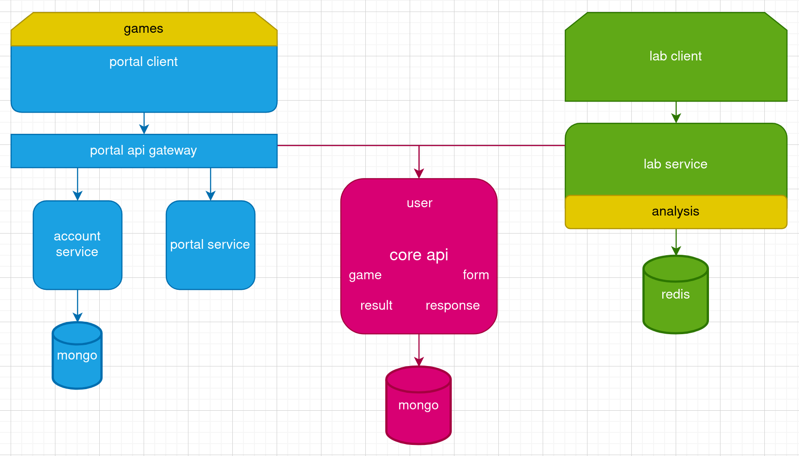

# Techmetrica Public Repo for Employers

Our documentation is being updated regularly

First iteration of [techmetrica.org](https://techmetrica.org) will be available SOON!

### **Architecture** and **Software Design** - by [Gevorg Atoyan](https://linkedin.com/in/gevorgatoyan/)@[Nyvia Projects](https://github.com/nyvia-projects)

---

### Monorepo setup and project configuration by [Gevorg Atoyan](https://linkedin.com/in/gevorgatoyan/)@[Nyvia Projects](https://github.com/nyvia-projects)

Our choice of Node package manager is [pnpm](https://pnpm.io/) for its better disk and resource utilization. In our **pnpm workspace** we also configured [nx](https://nx.dev/) monorepo which aids in simplifying development & operations workflow.
**nx** helps us to improve build and test performance by offering caching, it also enhances dependency management, code reusability, collaboration among developers, as well as its seamless integration with CI/CD pipelines.

---

### Microservice containerization and deployment by [Gevorg Atoyan](https://linkedin.com/in/gevorgatoyan/)@[Nyvia Projects](https://github.com/nyvia-projects)
